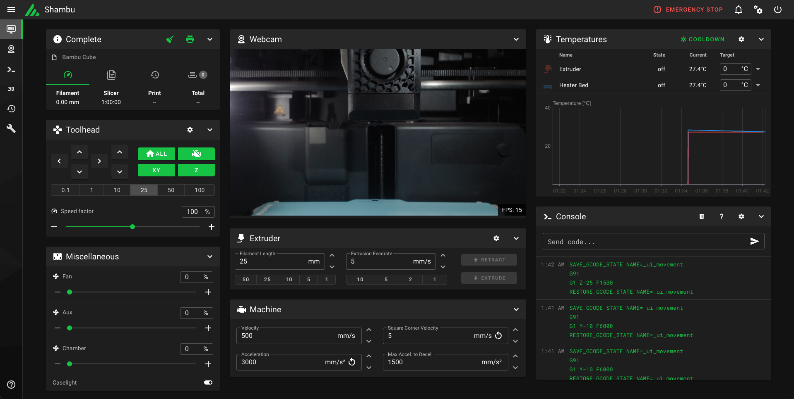

> [!WARNING] 
> **DISCLAIMER**
>
> This project is an **unofficial, experimental shim** that communicates with Bambu Lab printers using their documented and undocumented LAN interfaces.
>
> - This is **NOT** supported by Bambu Lab.
> - This project may break with firmware updates.
> - There is **NO WARRANTY** of safety, correctness, or fitness for any purpose.
> - You are responsible for **anything that happens to your printer** while using this software.
>
> By using this project, you acknowledge that you are doing so **at your own risk**.
> If that makes you uncomfortable, this project is not for you.

# Bambu Moonraker Shim

A lightweight shim that bridges **Bambu Lab printers** (P1 / X1 / A1 series) to **Mainsail** (and potentially other Moonraker clients) by emulating a **subset** of the Moonraker API.

This allows you to use the Mainsail UI to **monitor and partially control** a Bambu printer **without rooting it, flashing firmware, or installing Klipper**.



## What This Project Is (and Is Not)

**This is:**

* A protocol shim
* A compatibility layer
* A "Moonraker impersonator" that translates requests to Bambu's LAN MQTT / FTPS interfaces

**This is not:**

* Klipper
* A firmware replacement
* A complete Moonraker implementation
* Endorsed or supported by Bambu Lab

## Features (Current State)

### Connection

* Connects to Bambu printers over **LAN MQTT**
* Supports **LAN mode**

### Monitoring (Working)

* Live temperature **display**:
  * Extruder
  * Bed
* Print state:
  * Ready
  * Printing
  * Paused
  * Complete
* Job progress
* Currently loaded filename

### Control (Working)

* **Print control**:
  * Pause / Resume / Cancel prints
* **Temperature control**:
  * Set bed temperature (M190 / Moonraker commands)
  * Set extruder temperature (M109 / Moonraker commands)
  * Set chamber temperature (M191 / Moonraker commands)
* **Klipper macro support**:
  * `PRINT_START` / `START_PRINT` (with bed/hotend/chamber parameters)
  * `PRINT_END` / `END_PRINT`
  * `PAUSE` / `RESUME` / `CANCEL_PRINT`
  * `BED_MESH_CALIBRATE` (accepted, auto-leveling is automatic)
* Manual G-code command sending (limited)
* XYZ movement
* Homing
* Fan control:
  * Part cooling
  * Auxiliary
  * Chamber / exhaust
* Chamber LED on / off

### Files (Partial / Experimental)

* Mainsail file browser compatibility (`gcodes` + `config` roots)
* File listing (via printer FTPS)
* File upload (via FTPS)
* File deletion (via FTPS)
* File download endpoint for `gcodes` (local in mock mode, FTPS-backed with printer)

## What Does NOT Work (Yet)

* ❌ Full interactive G-code console
* ❌ Custom user-defined Klipper macros
* ❌ Webcam bridging
* ❌ Job queueing
* ❌ Full Moonraker API parity

If you are expecting a drop-in Klipper replacement, this is not that.

## Prerequisites

* **Python 3.9+**
* **Mainsail**
* **Bambu Lab printer**:
  * P1P
  * P1S
  * X1 / X1C / X1E
  * A1 / A1 Mini (experimental)

## Installation

1. **Clone the repository**

   ```bash
   git clone https://github.com/justinh-rahb/bambu-moonraker-shim.git
   cd bambu-moonraker-shim
   ```

2. **Create a virtual environment (recommended)**

   ```bash
   python -m venv venv
   source venv/bin/activate  # Windows: venv\Scripts\activate
   ```

3. **Install dependencies**

   ```bash
   pip install -r requirements.txt
   ```

## Configuration

Create a `.env` file in the project root:

```bash
# Bambu Printer Config
BAMBU_HOST=192.168.1.100
BAMBU_ACCESS_CODE=12345678
BAMBU_SERIAL=01P00A12345678
BAMBU_MODEL=P1S

# Connection Mode
BAMBU_MODE=local

# Server Config
HTTP_PORT=7125
LOG_LEVEL=INFO
GCODES_DIR=gcodes

# FTPS Settings (for file operations)
BAMBU_FTPS_UPLOADS_DIR=/
```

### Configuration Notes

* **BAMBU_HOST**: Your printer's IP address (find in printer settings)
* **BAMBU_ACCESS_CODE**: LAN access code (displayed on printer screen)
* **BAMBU_SERIAL**: Printer serial number (displayed on printer screen)
* **BAMBU_MODEL**: Optional model hint (`H2D`, `P2S`, `N7`, `A1`, `A1 Mini`) for model-specific behavior. `P1*`/`A1*` models hide chamber temperature objects in Mainsail.
* **BAMBU_MODE**: Use `local` for LAN-only mode (recommended)

## Usage

1. **Start the shim**

   ```bash
   python main.py
   ```

2. **Configure Mainsail**

   * Open Mainsail
   * Go to **Settings → Printers**
   * Add a new printer
   * Set the URL to the machine running the shim (e.g. `http://192.168.1.50:7125`)

3. **Connect**

   * Mainsail should connect
   * The printer should appear as Ready / Printing
   * Temperatures and basic controls should function

## Docker

A Docker image is provided that bundles:

* This shim
* Mainsail UI
* Fluidd UI
* moonraker-cnc UI
* Nginx reverse proxy

### Build

```bash
docker build -t bambu-moonraker-shim .
```

Optional pinning for deterministic UI assets:

```bash
docker build -t bambu-moonraker-shim \
  --build-arg MAINSAIL_URL="https://github.com/mainsail-crew/mainsail/releases/download/v2.17.0/mainsail.zip" \
  --build-arg MAINSAIL_SHA256="d010f4df25557d520ccdbb8e42fc381df2288e6a5c72d3838a5a2433c7a31d4e" \
  --build-arg FLUIDD_URL="https://github.com/fluidd-core/fluidd/releases/download/v<fluidd-version>/fluidd.zip" \
  --build-arg FLUIDD_SHA256="<fluidd-zip-sha256>" \
  --build-arg CNC_UI_URL="https://github.com/justinh-rahb/moonraker-cnc/archive/56061199fb319d06fff9076f3895fd1e789d7587.zip" \
  --build-arg CNC_UI_SHA256="<cnc-ui-zip-sha256>" \
  .
```

### Run

```bash
docker run \
  --env-file .env \
  -p 8080:80 \
  -p 8081:81 \
  -p 8082:82 \
  -v "$PWD/bambu_shim.db:/app/bambu_shim.db" \
  -v "$PWD/moonraker.json:/app/moonraker.json" \
  bambu-moonraker-shim
```

Access UIs at:

```
Mainsail: http://localhost:8080
Fluidd:   http://localhost:8081
CNC UI:   http://localhost:8082
```

### Networking Notes

The container **must be able to reach the printer IP directly**.

If bridge networking causes issues, use host mode:

```bash
docker run \
  --env-file .env \
  --network host \
  -v "$PWD/bambu_shim.db:/app/bambu_shim.db" \
  -v "$PWD/moonraker.json:/app/moonraker.json" \
  bambu-moonraker-shim
```

Access Mainsail at:

```
http://localhost
```

Access Fluidd at:

```
http://localhost:81
```

Access moonraker-cnc UI at:

```
http://localhost:82
```

### Persistent Data

The bind mounts above persist runtime data across container restarts:

* `bambu_shim.db` - SQLite data store used by the shim
* `moonraker.json` - Moonraker-style JSON database (Mainsail settings, webcam entries, etc.)

Create files once if needed:

```bash
touch bambu_shim.db moonraker.json
```

### Mock Mode (No Printer)

To run in mock mode (no `BAMBU_SERIAL` / no `.env`), start without `--env-file`:

```bash
docker run \
  -p 8080:80 \
  -p 8081:81 \
  -p 8082:82 \
  -v "$PWD/bambu_shim.db:/app/bambu_shim.db" \
  -v "$PWD/moonraker.json:/app/moonraker.json" \
  bambu-moonraker-shim
```

## Fan Control

The shim maps Mainsail fan controls to Bambu's MQTT G-code interface:

| Fan       | G-code    | Description           |
| --------- | --------- | --------------------- |
| `part`    | `M106 P1` | Part cooling fan      |
| `aux`     | `M106 P2` | Auxiliary fan         |
| `chamber` | `M106 P3` | Chamber / exhaust fan |

* Fan speeds are clamped to `0–255`
* Percent inputs are converted automatically
* All commands are sent with a trailing newline (required by Bambu MQTT)

## Temperature Control

### Setting Temperatures

The shim supports multiple ways to control heater temperatures:

#### Via G-code
```gcode
M109 S220        # Set extruder to 220°C
M190 S60         # Set bed to 60°C
M191 S45         # Set chamber to 45°C
```

#### Via Moonraker Command
```gcode
SET_HEATER_TEMPERATURE HEATER=extruder TARGET=220
SET_HEATER_TEMPERATURE HEATER=heater_bed TARGET=60
SET_HEATER_TEMPERATURE HEATER=heater_chamber TARGET=45
```

### Supported Ranges

* **Bed**: 0-120°C
* **Extruder**: 0-300°C
* **Chamber**: 0-70°C

### Important Notes

**Behavior notes:**
* Heater commands are sent using MQTT G-code (`M109`, `M190`, `M191`)
* The shim tracks target temperatures locally when MQTT telemetry does not immediately echo targets

## Klipper Macro Support

The shim provides compatibility with common Klipper macros used by slicers. This allows you to use your existing slicer profiles without modification.

### PRINT_START / START_PRINT

Used by slicers to initialize the printer. Supports parameter variants from different slicers:

```gcode
PRINT_START BED=60 HOTEND=220
PRINT_START BED_TEMP=60 EXTRUDER_TEMP=220
START_PRINT BED=60 HOTEND=220 CHAMBER=45
```

**Supported parameters:**
* `BED` or `BED_TEMP` - Bed temperature
* `HOTEND`, `EXTRUDER`, or `EXTRUDER_TEMP` - Nozzle temperature
* `CHAMBER` - Chamber temperature target

**Actions performed:**
1. Home all axes (G28)
2. Heat bed to target temperature
3. Heat nozzle to target temperature
4. Heat chamber to target temperature when provided
5. Auto-leveling (handled automatically by Bambu printer)

### PRINT_END / END_PRINT

Used by slicers to clean up after printing:

```gcode
PRINT_END
END_PRINT
```

**Actions performed:**
1. Set heaters to 0°C
2. Turn off all fans (part cooling, aux, chamber)
3. Disable motors

**Note:** Cooling behavior is firmware-controlled.

### Other Supported Macros

* `PAUSE` - Pause current print
* `RESUME` - Resume paused print
* `CANCEL_PRINT` - Cancel/stop current print
* `BED_MESH_CALIBRATE` - Accepted (Bambu auto-levels automatically, no action needed)

### Slicer Configuration Examples

#### PrusaSlicer / SuperSlicer

**Start G-code:**
```gcode
PRINT_START EXTRUDER_TEMP={first_layer_temperature[initial_extruder]} BED_TEMP=[first_layer_bed_temperature]
```

**End G-code:**
```gcode
PRINT_END
```

#### OrcaSlicer (Recommended for Bambu)

**Start G-code:**
```gcode
PRINT_START BED=[first_layer_bed_temperature] HOTEND={first_layer_temperature[initial_extruder]}
```

**End G-code:**
```gcode
PRINT_END
```

#### Cura

**Start G-code:**
```gcode
START_PRINT BED_TEMP={material_bed_temperature_layer_0} HOTEND={material_print_temperature_layer_0}
```

**End G-code:**
```gcode
END_PRINT
```

## Known Issues

### Temperature Control

* The shim uses heater commands over MQTT (`M109`, `M190`, `M191`)
* Firmware behavior can vary by printer and firmware revision

### FTPS File Operations

* File caching is implemented to reduce load on printer
* Cache invalidation happens on uploads/deletes
* Large file listings may be slow on first load
* File operations require same credentials as MQTT (username: `bblp`, password: access code)
* In mock mode (no `BAMBU_SERIAL`), file browsing uses local mock files and does not require FTPS

### General

* **LAN-only mode recommended**: For full local control, set your printer to LAN-only mode in Bambu Studio/Handy app
* **Firmware updates**: Bambu firmware updates may change MQTT/FTPS behavior
* **No custom macros**: Only the built-in macros listed above are supported; custom user-defined macros cannot be added
* **Print start**: Starting prints from uploaded files is supported, but behavior can vary by model/firmware and file format

## Troubleshooting

### Printer Not Connecting

1. Verify printer IP address is correct
2. Check LAN access code matches printer screen
3. Ensure printer serial number is correct
4. Try LAN-only mode on printer (disable cloud connection)
5. Check firewall isn't blocking port 8883 (MQTT) or 990 (FTPS)

### Temperature Commands Not Working

1. **For heating**: Use `M109`, `M190`, and `M191` or `SET_HEATER_TEMPERATURE`
2. **For direct control**: Use `M109`, `M190`, and `M191` or `SET_HEATER_TEMPERATURE`
3. **For turning off**: Set target to `0` and allow firmware-managed cooldown
4. Ensure printer is in LAN-only mode (not connected to cloud)
5. Check that commands sent via console include proper formatting

### Macros Not Working

1. Verify macro name is spelled correctly (case-insensitive)
2. Check parameter names match supported variants (BED vs BED_TEMP, etc.)
3. Look for error messages in shim console output
4. Try sending equivalent G-code commands directly to verify printer response

### File Operations Failing

1. Verify FTPS credentials (same as MQTT: `bblp` / access code)
2. Check printer allows local FTPS connections
3. Try refreshing file list to clear cache
4. Ensure printer is not in cloud-only mode

### G-codes Tab Missing In Mainsail

1. Hard refresh Mainsail (`Ctrl+Shift+R` / `Cmd+Shift+R`)
2. Confirm `/server/info` includes `registered_directories` with `gcodes`
3. Confirm `/server/files/roots` returns both `gcodes` and `config`
4. In mock mode, run without `.env` so FTPS is not queried

## Limitations / Roadmap

* Better start print implementation
* Full G-code console with command history
* User-defined custom macros
* Webcam bridging
* More complete Moonraker API coverage
* Better error handling and state reconciliation
* Enhanced job history tracking

This project is evolving quickly and may break at any time.

## Contributing

Contributions are welcome! Please:

1. Test your changes thoroughly
2. Follow existing code style
3. Document new features
4. Submit pull requests against the main branch

## License

MIT License — see [LICENSE](LICENSE).
